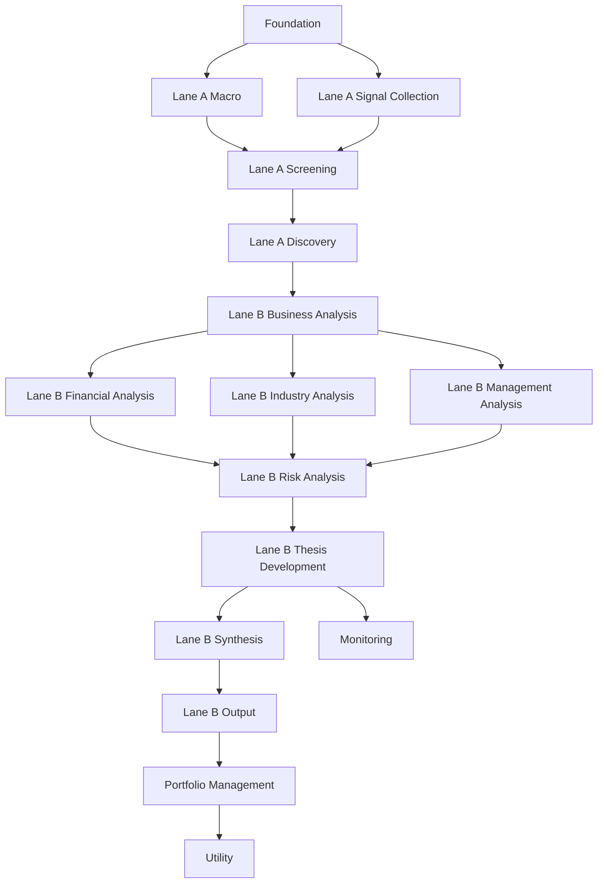

# ARC Investment Factory - Prompt Implementation Plan

## Overview

Este documento detalha o plano de implementação completo para os **116 prompts** do sistema ARC Investment Factory, incluindo dependências, ordem de execução e estimativas de esforço.

---

## Implementation Architecture

### Estrutura de Arquivos

```
packages/worker/src/prompts/
├── library/
│   ├── prompts_full.json          # Biblioteca principal de prompts
│   └── prompts.json               # Backup/legacy
├── templates/
│   ├── lane_a/                    # Templates Lane A
│   │   ├── screening/
│   │   ├── signal_collection/
│   │   ├── macro_context/
│   │   ├── analysis/
│   │   └── discovery/
│   └── lane_b/                    # Templates Lane B
│       ├── business_analysis/
│       ├── financial_analysis/
│       ├── industry_analysis/
│       ├── management_analysis/
│       ├── risk_analysis/
│       ├── catalyst_analysis/
│       ├── thesis_development/
│       ├── synthesis/
│       └── output/
├── executors/
│   ├── llm-executor.ts            # Executor para prompts LLM
│   ├── code-executor.ts           # Executor para prompts code-based
│   └── hybrid-executor.ts         # Executor híbrido
├── library-loader.ts              # Carregador da biblioteca
├── orchestrator.ts                # Orquestrador de prompts
├── selector.ts                    # Seletor baseado em valor
└── types.ts                       # Definições de tipos
```

---

## Phase 1: Foundation (Week 1)

### 1.1 Update Prompt Schema

**Objetivo:** Atualizar o schema de prompts para suportar todos os campos necessários.

**Arquivo:** `packages/worker/src/prompts/types.ts`

```typescript
interface PromptDefinition {
  // Identification
  prompt_id: string;
  name: string;
  version: string;
  
  // Classification
  category: string;
  subcategory: string;
  lane: 'lane_a' | 'lane_b' | 'portfolio' | 'monitoring' | 'utility';
  stage: string;
  
  // Execution
  executor_type: 'llm' | 'code' | 'hybrid';
  llm_config?: {
    provider: 'openai' | 'anthropic' | 'perplexity';
    model: string;
    temperature: number;
    max_tokens: number;
  };
  
  // Template
  template: string;
  variables: string[];
  
  // Data Dependencies
  required_data_sources: string[];
  input_schema: JSONSchema;
  output_schema: JSONSchema;
  
  // Value Metrics
  expected_value_score: number;
  expected_cost_score: number;
  value_cost_ratio: number;
  criticality: 'critical' | 'high' | 'medium' | 'low';
}
```

### 1.2 Create Prompt Migration Script

**Objetivo:** Migrar os 116 prompts do markdown para JSON estruturado.

**Script:** `scripts/migrate_prompts.ts`

**Dependências:** Nenhuma

**Estimativa:** 2 horas

---

## Phase 2: Lane A Implementation (Week 1-2)

### 2.1 Macro Context Prompts (16 prompts)

**Prioridade:** Alta - Fornece contexto para todas as análises

| # | Prompt ID | Dependências | Estimativa |
|---|-----------|--------------|------------|
| 1 | `macro_environment_analysis` | Nenhuma | 1h |
| 2 | `fed_policy_analysis` | Nenhuma | 1h |
| 3 | `inflation_analysis` | Nenhuma | 1h |
| 4 | `yield_curve_analysis` | Nenhuma | 1h |
| 5 | `credit_cycle_analysis` | Nenhuma | 1h |
| 6 | `liquidity_conditions_analysis` | Nenhuma | 1h |
| 7 | `market_regime_analysis` | Nenhuma | 1h |
| 8 | `sector_sensitivity_analysis` | `market_regime_analysis` | 1h |
| 9 | `geopolitical_risk_analysis` | Nenhuma | 1h |
| 10 | `election_impact_analysis` | Nenhuma | 1h |
| 11 | `china_macro_analysis` | Nenhuma | 1h |
| 12 | `commodity_analysis` | Nenhuma | 1h |
| 13 | `currency_analysis` | Nenhuma | 1h |
| 14 | `global_macro_scan` | Todos acima | 2h |
| 15 | `earnings_season_preview` | Nenhuma | 1h |
| 16 | `economic_indicator_analysis` | Nenhuma | 1h |

**Total Estimado:** 18 horas

### 2.2 Signal Collection Prompts (9 prompts)

**Prioridade:** Alta - Coleta sinais para geração de ideias

| # | Prompt ID | Dependências | Data Sources | Estimativa |
|---|-----------|--------------|--------------|------------|
| 1 | `social_sentiment_scanner` | Nenhuma | Reddit, Twitter | 2h |
| 2 | `insider_trading_analysis` | Nenhuma | SEC EDGAR | 2h |
| 3 | `institutional_clustering_13f` | Nenhuma | SEC 13F | 2h |
| 4 | `newsletter_idea_scraping` | Nenhuma | RSS feeds | 2h |
| 5 | `niche_publication_scanner` | Nenhuma | Web scraping | 2h |
| 6 | `reddit_memestock_scraper` | Nenhuma | Reddit API | 2h |
| 7 | `substack_idea_scraping` | Nenhuma | Substack | 2h |
| 8 | `twitter_copytrading_scraper` | Nenhuma | Twitter/X | 2h |
| 9 | `deep_web_trend_scanner` | Nenhuma | Multiple | 3h |

**Total Estimado:** 19 horas

### 2.3 Screening Prompts (8 prompts)

**Prioridade:** Alta - Filtra candidatos de investimento

| # | Prompt ID | Dependências | Estimativa |
|---|-----------|--------------|------------|
| 1 | `thematic_idea_generator` | `macro_environment_analysis` | 2h |
| 2 | `thematic_candidate_screen` | `thematic_idea_generator` | 2h |
| 3 | `pure_play_filter` | Nenhuma | 1h |
| 4 | `identify_pure_plays` | `pure_play_filter` | 1h |
| 5 | `theme_order_effects` | `thematic_idea_generator` | 1h |
| 6 | `theme_subsector_expansion` | `thematic_candidate_screen` | 1h |
| 7 | `connecting_disparate_trends` | `macro_environment_analysis` | 2h |
| 8 | `under_radar_discovery` | Nenhuma | 2h |

**Total Estimado:** 12 horas

---

## Phase 3: Lane B Core Research (Week 2-3)

### 3.1 Business Analysis Prompts (6 prompts)

**Prioridade:** Crítica - Base da análise fundamental

| # | Prompt ID | Dependências | Data Sources | Estimativa |
|---|-----------|--------------|--------------|------------|
| 1 | `business_overview_report` | Nenhuma | FMP, SEC | 2h |
| 2 | `business_economics` | `business_overview_report` | FMP | 2h |
| 3 | `customer_analysis` | `business_overview_report` | SEC 10-K | 2h |
| 4 | `geographic_analysis` | `business_overview_report` | SEC 10-K | 1h |
| 5 | `supply_chain_analysis` | `business_overview_report` | SEC, News | 2h |
| 6 | `technology_ip_analysis` | `business_overview_report` | Patents, SEC | 2h |

**Total Estimado:** 11 horas

### 3.2 Financial Analysis Prompts (10 prompts)

**Prioridade:** Crítica - Análise financeira detalhada

| # | Prompt ID | Dependências | Estimativa |
|---|-----------|--------------|------------|
| 1 | `financial_statement_analysis` | Nenhuma | 2h |
| 2 | `valuation_analysis` | `financial_statement_analysis` | 3h |
| 3 | `earnings_quality_analysis` | `financial_statement_analysis` | 2h |
| 4 | `capital_allocation_analysis` | `financial_statement_analysis` | 2h |
| 5 | `capital_structure_optimizer` | `financial_statement_analysis` | 2h |
| 6 | `debt_structure_analysis` | `financial_statement_analysis` | 1h |
| 7 | `growth_margin_drivers` | `financial_statement_analysis` | 2h |
| 8 | `ma_history_analysis` | Nenhuma | 2h |
| 9 | `segment_analysis` | `financial_statement_analysis` | 2h |
| 10 | `working_capital_analysis` | `financial_statement_analysis` | 1h |

**Total Estimado:** 19 horas

### 3.3 Industry Analysis Prompts (3 prompts)

| # | Prompt ID | Dependências | Estimativa |
|---|-----------|--------------|------------|
| 1 | `industry_overview` | Nenhuma | 2h |
| 2 | `competitive_analysis` | `industry_overview` | 2h |
| 3 | `tam_sam_som_analyzer` | `industry_overview` | 2h |

**Total Estimado:** 6 horas

### 3.4 Management Analysis Prompts (2 prompts)

| # | Prompt ID | Dependências | Estimativa |
|---|-----------|--------------|------------|
| 1 | `management_quality_assessment` | `business_overview_report` | 2h |
| 2 | `ceo_track_record` | Nenhuma | 2h |

**Total Estimado:** 4 horas

### 3.5 Risk Analysis Prompts (3 prompts)

| # | Prompt ID | Dependências | Estimativa |
|---|-----------|--------------|------------|
| 1 | `risk_assessment` | Todos os módulos anteriores | 2h |
| 2 | `risk_factor_identifier` | `business_overview_report` | 2h |
| 3 | `regulatory_risk_analysis` | `industry_overview` | 2h |

**Total Estimado:** 6 horas

---

## Phase 4: Lane B Synthesis (Week 3)

### 4.1 Thesis Development Prompts (5 prompts)

| # | Prompt ID | Dependências | Estimativa |
|---|-----------|--------------|------------|
| 1 | `bull_bear_analysis` | Todos os módulos de research | 2h |
| 2 | `investment_thesis_synthesis` | `bull_bear_analysis` | 3h |
| 3 | `variant_perception` | `investment_thesis_synthesis` | 2h |
| 4 | `contrarian_thesis_development` | `investment_thesis_synthesis` | 2h |
| 5 | `peer_thesis_comparison` | `investment_thesis_synthesis` | 2h |

**Total Estimado:** 11 horas

### 4.2 Synthesis & Output Prompts (4 prompts)

| # | Prompt ID | Dependências | Estimativa |
|---|-----------|--------------|------------|
| 1 | `bull_bear_case_generator` | `bull_bear_analysis` | 2h |
| 2 | `earnings_preview_generator` | `financial_statement_analysis` | 2h |
| 3 | `investment_memo` | `investment_thesis_synthesis` | 3h |
| 4 | `thesis_presentation` | `investment_memo` | 2h |

**Total Estimado:** 9 horas

---

## Phase 5: Special Situations & Monitoring (Week 4)

### 5.1 Special Situations Prompts (3 prompts)

| # | Prompt ID | Dependências | Estimativa |
|---|-----------|--------------|------------|
| 1 | `activist_situation_analyzer` | `business_overview_report` | 3h |
| 2 | `ipo_analysis` | `valuation_analysis` | 3h |
| 3 | `spinoff_opportunity_analyzer` | `business_overview_report` | 3h |

**Total Estimado:** 9 horas

### 5.2 Monitoring Prompts (4 prompts)

| # | Prompt ID | Dependências | Estimativa |
|---|-----------|--------------|------------|
| 1 | `thesis_monitoring_framework` | `investment_thesis_synthesis` | 2h |
| 2 | `thesis_update` | `thesis_monitoring_framework` | 2h |
| 3 | `news_sentiment_monitor` | Nenhuma | 2h |
| 4 | `pre_mortem_analysis` | `investment_thesis_synthesis` | 2h |

**Total Estimado:** 8 horas

---

## Phase 6: Portfolio Management (Week 4-5)

### 6.1 Portfolio Construction Prompts (4 prompts)

| # | Prompt ID | Dependências | Estimativa |
|---|-----------|--------------|------------|
| 1 | `portfolio_construction` | Nenhuma | 3h |
| 2 | `position_sizer` | `portfolio_construction` | 2h |
| 3 | `position_sizing` | `position_sizer` | 1h |
| 4 | `exit_strategy` | `investment_thesis_synthesis` | 2h |

**Total Estimado:** 8 horas

### 6.2 Portfolio Risk Management Prompts (10 prompts)

| # | Prompt ID | Dependências | Estimativa |
|---|-----------|--------------|------------|
| 1 | `risk_monitoring` | `portfolio_construction` | 2h |
| 2 | `scenario_analysis` | `portfolio_construction` | 2h |
| 3 | `drawdown_analysis` | `portfolio_construction` | 1h |
| 4 | `correlation_analysis` | `portfolio_construction` | 1h |
| 5 | `factor_exposure_analysis` | `portfolio_construction` | 2h |
| 6 | `factor_exposure_analyzer` | `factor_exposure_analysis` | 1h |
| 7 | `liquidity_analysis` | `portfolio_construction` | 1h |
| 8 | `benchmark_comparison` | `portfolio_construction` | 1h |
| 9 | `performance_attribution` | `portfolio_construction` | 2h |
| 10 | `income_analysis` | `portfolio_construction` | 1h |

**Total Estimado:** 14 horas

### 6.3 Portfolio Execution & Other (7 prompts)

| # | Prompt ID | Dependências | Estimativa |
|---|-----------|--------------|------------|
| 1 | `rebalancing_analysis` | `portfolio_construction` | 2h |
| 2 | `transition_management` | `portfolio_construction` | 2h |
| 3 | `currency_hedging_analysis` | `portfolio_construction` | 2h |
| 4 | `options_overlay_strategy` | `portfolio_construction` | 2h |
| 5 | `investment_policy_compliance` | `portfolio_construction` | 1h |
| 6 | `tax_loss_harvesting` | `portfolio_construction` | 1h |
| 7 | `sector_rotation_analysis` | `portfolio_construction` | 2h |

**Total Estimado:** 12 horas

---

## Phase 7: Utility & Market Analysis (Week 5)

### 7.1 Utility Prompts (7 prompts)

| # | Prompt ID | Dependências | Estimativa |
|---|-----------|--------------|------------|
| 1 | `daily_market_briefing` | `macro_environment_analysis` | 2h |
| 2 | `earnings_call_analysis` | Nenhuma | 2h |
| 3 | `news_sentiment_analysis` | Nenhuma | 1h |
| 4 | `sec_filing_analysis` | Nenhuma | 2h |
| 5 | `research_report_summary` | Nenhuma | 1h |
| 6 | `competitor_earnings_comparison` | `financial_statement_analysis` | 2h |
| 7 | `watchlist_screening` | Nenhuma | 1h |

**Total Estimado:** 11 horas

### 7.2 Market Analysis Prompts (4 prompts)

| # | Prompt ID | Dependências | Estimativa |
|---|-----------|--------------|------------|
| 1 | `earnings_season_analyzer` | Nenhuma | 2h |
| 2 | `sector_momentum_ranker` | Nenhuma | 2h |
| 3 | `competitive_landscape_mapping` | `industry_overview` | 2h |
| 4 | `historical_parallel_finder` | Nenhuma | 2h |

**Total Estimado:** 8 horas

---

## Implementation Summary

### Total Effort Estimate

| Phase | Prompts | Hours | Week |
|-------|---------|-------|------|
| Phase 1: Foundation | - | 4h | 1 |
| Phase 2: Lane A | 33 | 49h | 1-2 |
| Phase 3: Lane B Core | 24 | 46h | 2-3 |
| Phase 4: Lane B Synthesis | 9 | 20h | 3 |
| Phase 5: Special & Monitoring | 7 | 17h | 4 |
| Phase 6: Portfolio | 21 | 34h | 4-5 |
| Phase 7: Utility & Market | 11 | 19h | 5 |
| **TOTAL** | **116** | **189h** | **5 weeks** |

### Critical Path

```
Foundation → Lane A Macro → Lane A Screening → Lane A Discovery
                                    ↓
                            Lane B Business Analysis
                                    ↓
                            Lane B Financial Analysis
                                    ↓
                            Lane B Industry + Management + Risk
                                    ↓
                            Lane B Thesis Development
                                    ↓
                            Lane B Synthesis & Output
                                    ↓
                            Portfolio Management
                                    ↓
                            Monitoring & Utility
```

### Dependencies Graph



---

## Testing Strategy

### Unit Tests

Cada prompt deve ter testes unitários para:
1. Validação de input schema
2. Validação de output schema
3. Template rendering
4. Error handling

### Integration Tests

1. **Lane A Flow:** Macro → Screening → Discovery → Idea Generation
2. **Lane B Flow:** Business → Financial → Industry → Risk → Thesis → Output
3. **End-to-End:** Lane A → Promotion → Lane B → Portfolio

### Quality Gates

1. **Output Validation:** JSON schema compliance
2. **Content Quality:** Minimum length, required fields
3. **Cost Control:** Token usage within budget
4. **Performance:** Response time < 30s per prompt

---

## Rollout Plan

### Week 1: Foundation + Lane A Macro
- Deploy schema updates
- Implement 16 macro prompts
- Test with real data

### Week 2: Lane A Complete + Lane B Start
- Complete Lane A (33 prompts)
- Start Lane B Business Analysis
- Integration testing Lane A

### Week 3: Lane B Core
- Complete Lane B core research (24 prompts)
- Start thesis development
- Integration testing Lane B

### Week 4: Lane B Complete + Special
- Complete Lane B synthesis (9 prompts)
- Implement special situations
- Start monitoring prompts

### Week 5: Portfolio + Utility
- Complete portfolio management (21 prompts)
- Complete utility prompts (11 prompts)
- Full system integration testing
- Production deployment
